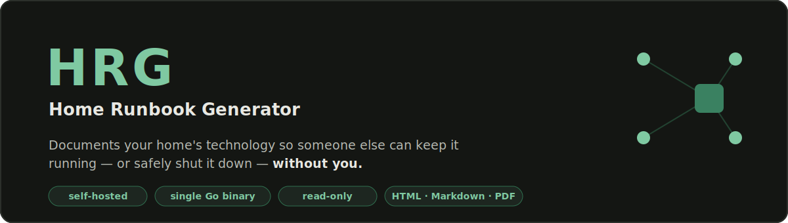
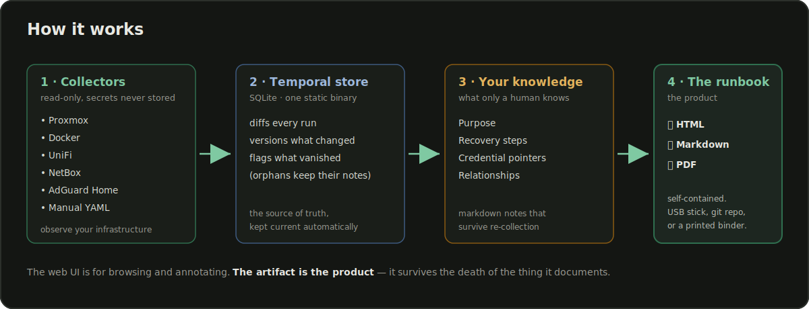
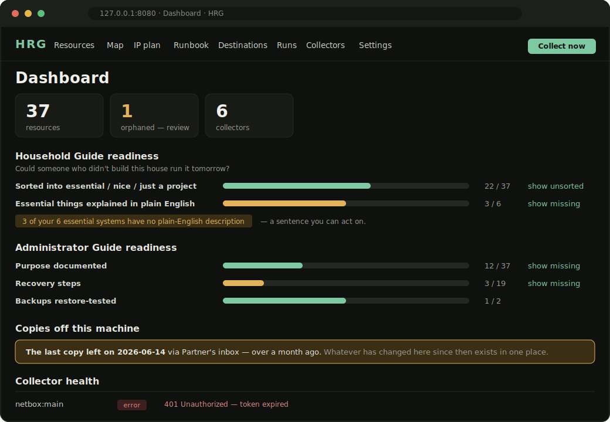
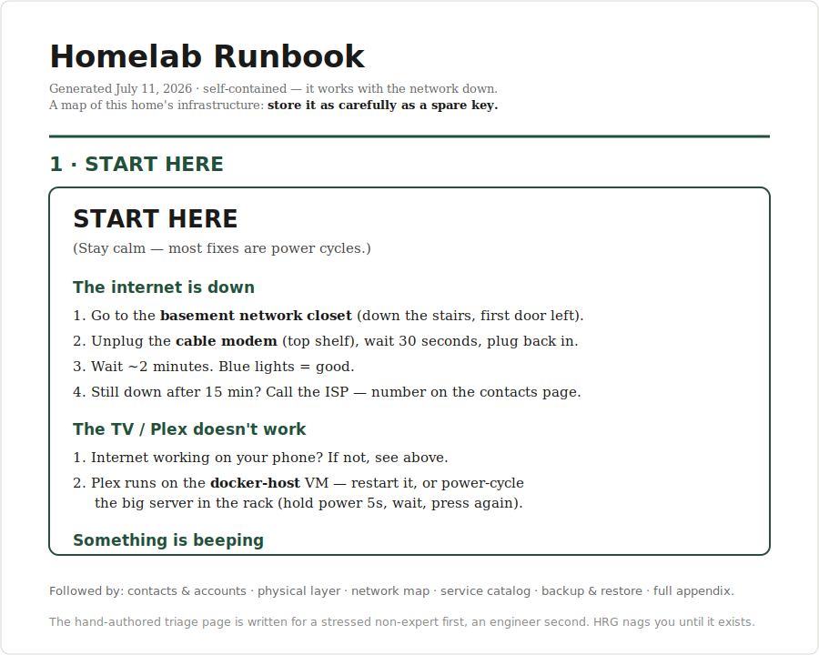

<p align="center">
  
</p>

<p align="center">
  
  
  
  
</p>

**HRG** documents your homelab from the infrastructure itself and keeps it
current automatically — then generates a portable **runbook** that works
when everything is on fire and the network is down. It's the "hit by a bus"
document your spouse, a friend, or future-you can actually follow: *the
internet is down, the TV won't play, something is beeping — here's what to
do.*

The web UI is for browsing and annotating. **The artifact is the product** —
a self-contained HTML page, a git-committable Markdown tree, and a printable
PDF that live on a USB stick or in a binder and survive the death of the
thing they document.

<p align="center">
  
</p>

---

## Two principles that shape everything

1. **The runbook must survive the death of the thing it documents.** Every
   generation produces a static, portable artifact. If HRG's own container
   is down, the last export still saves the day.
2. **Collectors are read-only, and secrets are never stored.** HRG records
   *where* credentials live ("1Password vault 'Home', item 'UDM-Pro'"),
   never the credentials themselves. The only secrets it holds are its own
   collector API tokens, encrypted at rest.

## What it looks like

The **dashboard** scores how complete your runbook is and nags on the gaps —
undocumented resources, services with no recovery steps, backups nobody has
restore-tested — and shows at a glance whether each collector is healthy:

<p align="center">
  
</p>

The **runbook artifact** is written for a stressed non-expert first. It
opens with a hand-authored triage page — plain language, physical
locations, power buttons — then the network map, service catalog, backup
coverage, and a full appendix:

<p align="center">
  
</p>

## Quick start

### Docker Compose (recommended)

```sh
git clone https://github.com/breed007/hrg && cd hrg
docker compose up -d
# → http://127.0.0.1:8080
```

The compose file publishes the UI on `127.0.0.1` only, and the image
bundles Chromium so PDF export works out of the box. Persistent state lives
in a named volume; your manual facts are read from `./resources.d`.

### Bare binary

Grab a build from the [releases page](https://github.com/breed007/hrg/releases),
or build it yourself — the only requirement is **Go 1.26+** (no Node, no C
compiler, no external services):

```sh
go build ./cmd/hrg
./hrg serve
# → http://127.0.0.1:8080
```

PDF export additionally wants a headless Chromium/Chrome on `PATH`; HTML and
Markdown export don't need it.

## First run: the setup wizard

A fresh install opens a five-step wizard that takes you from an empty
dashboard to a first runbook:

1. **Name it & choose where exports go.**
2. **Set an access password** — HRG has no auth until you set one; if it's
   reachable beyond your machine, protect it here.
3. **Add a collector** — point HRG at your infrastructure (read-only), with
   a **Test connection** button that catches a bad credential *before* you
   save. Or skip and describe things by hand in `resources.d/`.
4. **Write the START HERE page** — the most important page in the runbook,
   and the one only you can write. HRG pre-fills a skeleton.
5. **Generate your first runbook.**

You can re-run it any time at `/setup`.

## Collectors

Each collector is read-only; give it read-only credentials.

| Collector | Reads | Auth |
|---|---|---|
| **Proxmox** | nodes, VMs, LXCs, storage, backup jobs, HA state | API token (`PVEAuditor`) |
| **Docker** | containers, compose projects, volumes, networks | socket or TCP |
| **UniFi** | networks/VLANs, WLANs, devices + uplinks, firewall summary | API key (Network 9.0+) |
| **NetBox** | prefixes + IP assignments, devices, racks (authoritative IP plan) | read-only token |
| **AdGuard Home** | DNS rewrites, upstreams, DHCP + static leases | basic auth |
| **Manual (YAML)** | anything without an API — the modem, the ISP account, the UPS | — |

Collectors run on a schedule, **diff against the previous snapshot**, and
version what changed. A resource that disappears becomes an **orphan** —
flagged, never deleted, because your notes about it are the valuable part.
Every collector has a fixture mode for tests and demos, and
[writing a new one](docs/writing-collectors.md) is one method plus a test.

## The annotation layer

APIs answer *what*; only you answer *why*. Every resource takes four typed
markdown notes — **Purpose**, **Recovery procedure** (checklists render as
checkboxes), **Credential pointer**, and **Notes** — plus manual
relationships ("Plex needs the NAS mounted first"). Annotations are keyed to
resource *identity*, so they survive re-collection, attribute churn, and
container recreates.

## The runbook artifact

The **Runbook** page generates the actual product:

- **`runbook.html`** — one self-contained file: inline styles, inline
  topology diagram, no external references, no links back to the app.
- **`runbook-md/`** — a Markdown tree with the topology as a ```` ```mermaid ````
  fence (GitHub renders it natively). `git init` it once and every export
  becomes a commit — version history for free.
- **`runbook.pdf`** — the same, printed via headless Chromium, for the
  binder in the closet.

Output styling is yours: a paper size, a few built-in themes, or custom CSS.

## Staying current

HRG's job is partly to *guilt* you into finishing the document, and to keep
it fresh once you have:

- **Scheduled collection** — an in-process cron (`@daily`, `0 3 * * *`, …);
  no system cron, no queue.
- **Drift notifications** — point HRG at an [ntfy](https://ntfy.sh) topic or
  any webhook; a scheduled run that finds changes (or a collector failure)
  sends an alert.
- **Auto-regeneration** on drift, so the exported copy never goes stale.
- **Restore-test tracking** — record when you last actually tested a
  backup's restore. Untested backups show **"last verified: never"** in red.
  A backup nobody has restored is a hope, not a backup.

## Security posture

- **Authentication is optional and off until you set a password.** HRG is a
  single-user tool; one shared password gates the whole UI. The dashboard
  nags until it's set.
- **CSRF protection is always on** — state-changing requests are rejected
  unless they originate from HRG itself, so a malicious page in another tab
  can't drive your endpoints even with no password set.
- Binds `127.0.0.1` by default; sessions use `HttpOnly; SameSite=Strict`
  cookies. Terminate TLS at a reverse proxy for anything wider.
- Collector tokens are encrypted at rest (AES-256-GCM). The database, any
  export, and a config backup are all maps of your network — store them on
  encrypted disk or in a private repo.

## Configuration

```
hrg [flags] serve      collect once, then serve the web UI (default)
hrg [flags] collect    run all collectors once and exit

  -addr       listen address (default 127.0.0.1:8080)
  -db         SQLite database path (default hrg.db)
  -key        token-encryption key file (default hrg.key, created on first use)
  -resources  manual resources.d directory (default resources.d)
  -dev        enable developer affordances — never use in production
  -version    print version and exit
```

Configuration backup/restore (Settings → Configuration backup) exports the
non-regenerable state — collector configs, pages, annotations, settings — for
disaster recovery and host migration.

## Contributing

The most valuable contribution is a **new collector** — HRG can only
document gear someone has taught it to read. It's one method and a
fixture-backed test; see [docs/writing-collectors.md](docs/writing-collectors.md).
Development needs only Go 1.26+. Full guide in [CONTRIBUTING.md](CONTRIBUTING.md).

## Status

**v0.1.0** — the first public release. Six collectors, temporal diffing, the
annotation layer, network map & IP-plan reconciliation, runbook generation
(HTML + Markdown + PDF), scheduling, drift notifications, freshness tracking,
optional auth, and a setup wizard. Built as a single static binary with an
embedded UI and SQLite.

## License

[MIT](LICENSE)
